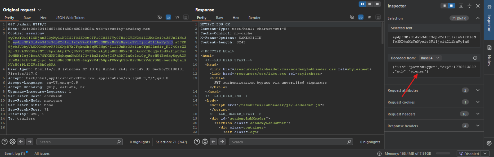
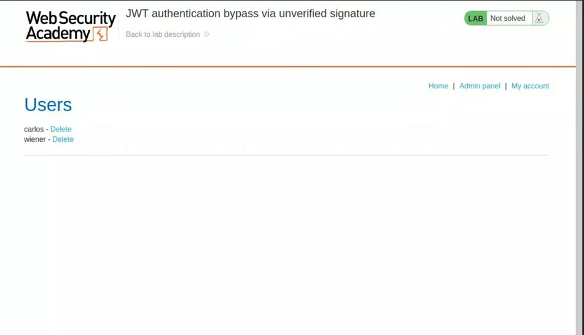

# 🧪 Lab: JWT Authentication Bypass via Unverified Signature

## 📌 Lab Overview

This lab demonstrates a critical authentication vulnerability in a JWT-based session handling mechanism.  

The application uses JSON Web Tokens (JWT) to manage user sessions. However, due to improper implementation, the server does **not verify the signature** of incoming JWTs.

### 🎯 Objective
- Access the `/admin` panel
- Delete the user `carlos`
- Provided credentials: `wiener:peter`

---

## 🔐 Understanding JWT Structure

A JSON Web Token consists of three parts:
header.payload.signature
- **Header** – Algorithm & token type  
- **Payload** – Contains claims such as `sub`  
- **Signature** – Ensures integrity  

If the signature is not verified, the token can be tampered with.

---

## 🧠 Token Inspection

After logging in as `wiener`, I attempted to access: /admin

The server responded with:

> "Admin interface only available if logged in as an administrator"

This indicates that access control depends on the authenticated user stored inside the JWT.

Using **Burp Suite (Proxy → HTTP History)**, I intercepted the authenticated request containing the JWT:


Using Burp’s **JWT Inspector**, I decoded the token and examined its contents.

### Header
```json
{
  "alg": "HS256",
  "typ": "JWT"
}
          
Using Burp Suite’s **JWT Inspector**, I identified the `sub` claim in the payload, which represents the authenticated username.



I modified the `sub` value from:

```json
"sub": "wiener"
```
to:
```
"sub": "administrator"
```

and by that we can access the admin panel



With administrative access obtained, I intercepted the request responsible for deleting users. I ensured that the JWT still contained `"sub": "administrator"` and sent the request to the server.

The request was processed successfully, and the user `carlos` was deleted, completing the lab.

