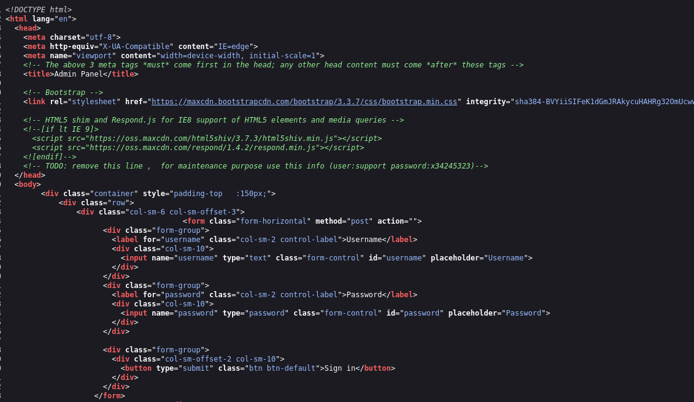
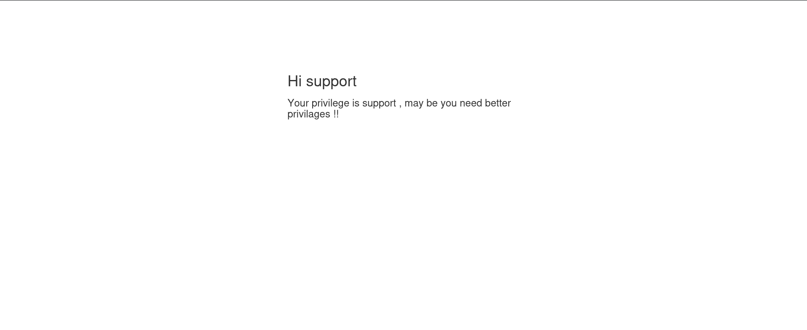
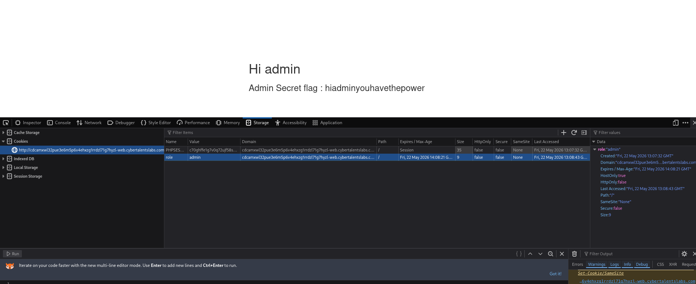

EASY LABS

Challenge name: Admin has the power

first thing I saw when I started the challenge is a login page

when I viewed the page source I found account credentials
 user:support password:x34245323

I logged in as support and in the inspect-> storage-> cookies
I found  a parameter for the role it said support so I changed it to admin

Admin Secret flag : hiadminyouhavethepower 