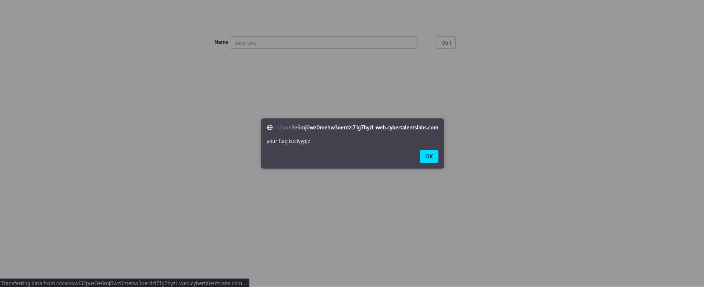

Challenge Name:   Cool Name Effect

I found a form that submits a name and write it in the page so I thought it might be a stored xss could be found so I tested an alert function

I found that it blocked the <script> opening tag so I tried a different approach 

I tried hiding the alert function  in an img tag I put src=x to make an error and then I used function onerror=alert(1) to call the alert function and it worked
 your flag is:ciyypjz

