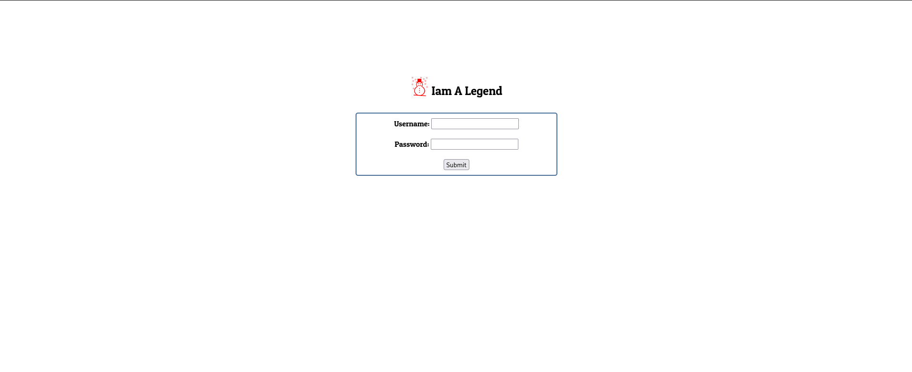
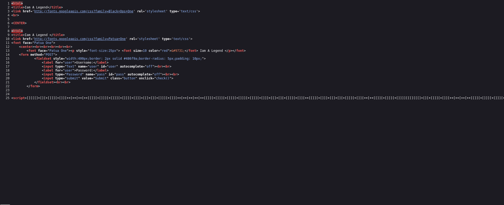
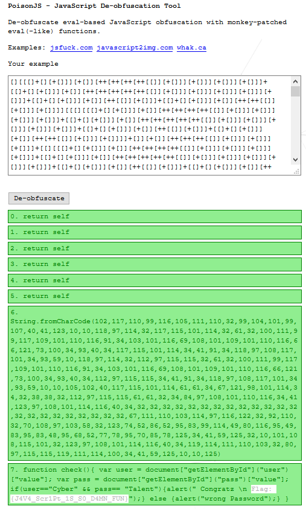

Challenge Name:   Iam Legend

I found a login page and then I tried inscpecting the page source I found a random characters and I found out that it’s an encryption way called jsfuck 

https://filipemgs.github.io/poisonjs/ I used this tool to decode the jsfuck and got the flag

Flag: {J4V4_Scr1Pt_1S_S0_D4MN_FUN}
