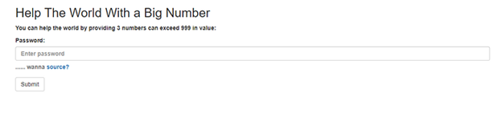
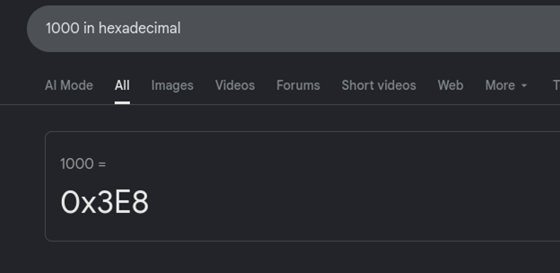
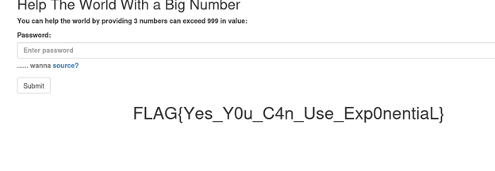

Challenge Name:  Big Number
First thing I Saw is an input area only accepting integers 

And in the source page
<?php if (isset($_GET['password'])) {
if (is_numeric($_GET['password'])){
if (strlen($_GET['password']) < 4){
if ($_GET['password'] > 999)
die($flag);
else
print 'Too little';
} else
print 'Too long';
} else
print 'Password is not numeric';
}
?>
means we need a number less than 4 digits and greater than 999 and we know that its writtin in php and php can understand hexadecimal so this is a way to put a number greater than 999 and less than 4 digits

3E8

And we got the flag
FLAG{Yes_Y0u_C4n_Use_Exp0nentiaL}

