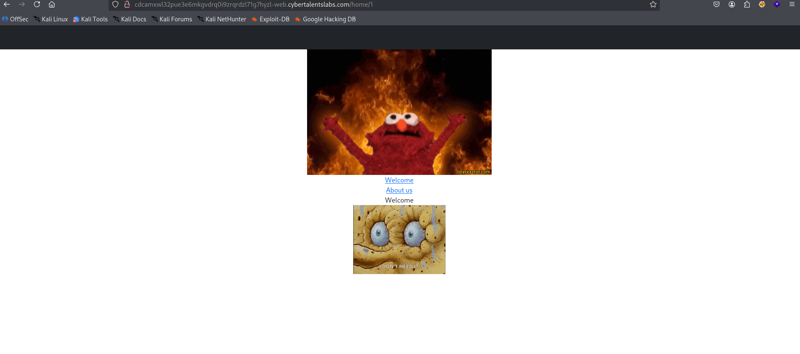
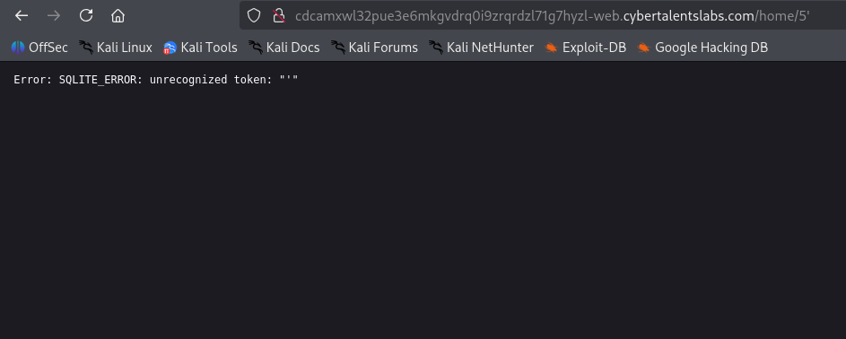
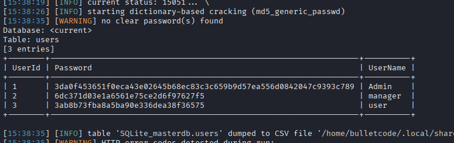
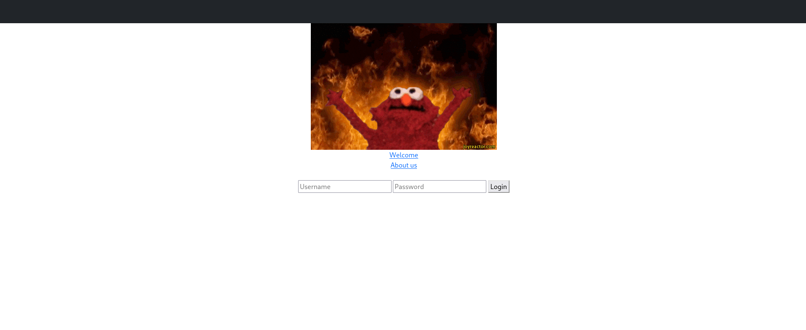
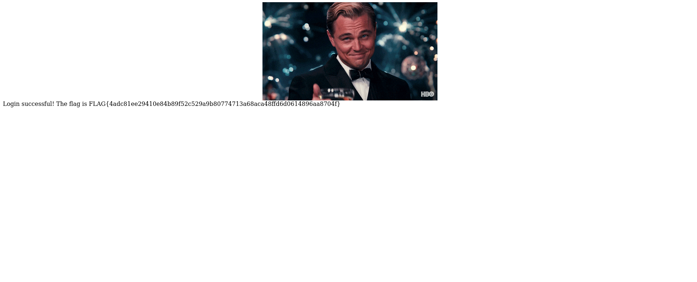

Challenge Name:  LiteSecret

After browsing in the home/ and trying different integers I tried injecting the dom and I found it might be vulnerable to sql injection

I tried sqlmap to try to dump any sqlite tables found and I got the admin credentials

I got the admin credentials Admin: 3da0f453651f0eca43e02645b68ec83c3c659b9d57ea556d0842047c9393c789
Then I tried to find a login page to use the credentials and I found the /login endpoint

The flag is FLAG{4adc81ee29410e84b89f52c529a9b80774713a68aca48ffd6d0614896aa8704f}