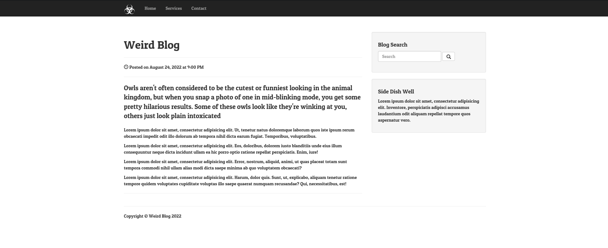
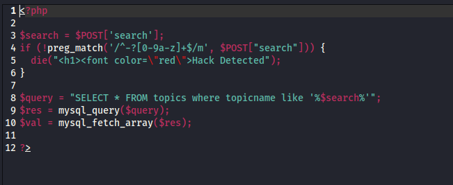
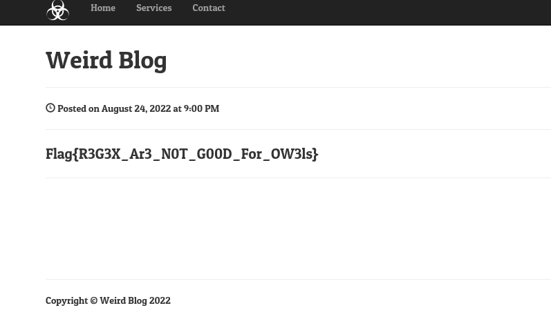

Challenge Name:  Owls Blog

When I try to use the search bar for any xss attack it returns hack detected

I found robots.txt containing an git.phps endpoint which appear to be a downloadable file

Since the search is between %% it can be bypassed https://owasp.org/www-community/attacks/SQL_Injection_Bypassing_WAF 
after trying the final payload will be h%0a ‘union SELECT flag FROM flag #

Flag{R3G3X_Ar3_N0T_G00D_For_OW3ls}