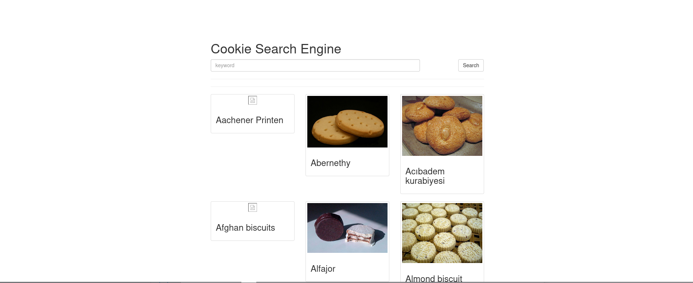
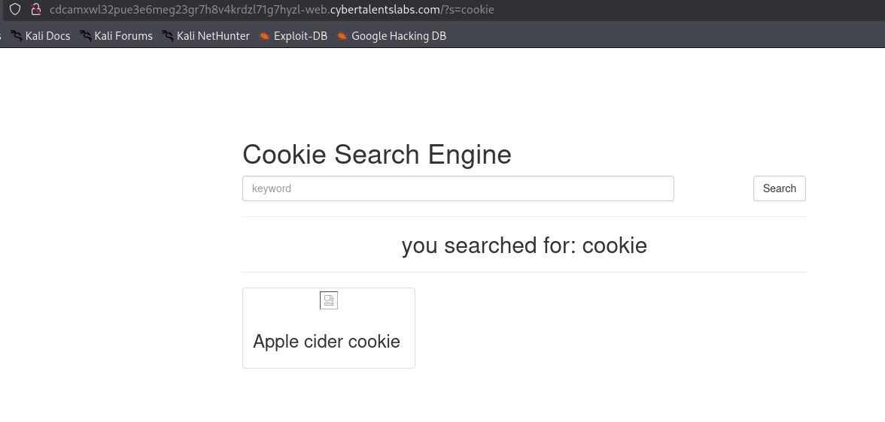
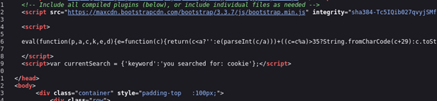
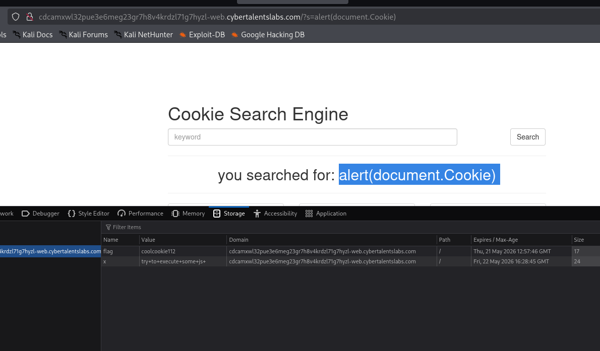

Challenge Name: Searching for the cookie
First I Found the landing page containing search

By trying to search for something and looking in the source code

the search query is being rendered in the DOM which could lead to a possible DOM XSS attack

So the payload I tried is to make an alert with the cookies alert(document.Cookie) 
And I found a new parameter in the storage containing the flag 

Flag:  coolcookie112