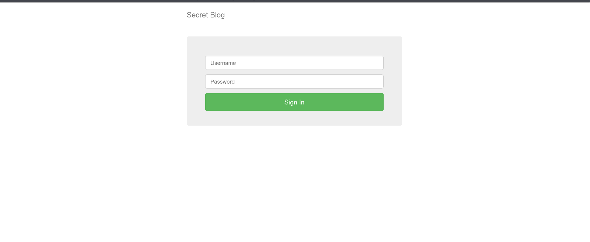
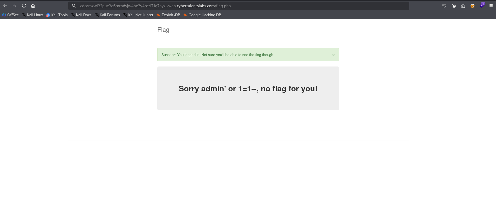
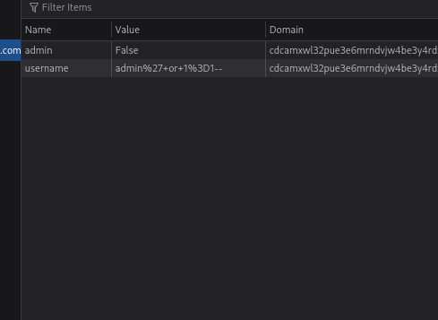
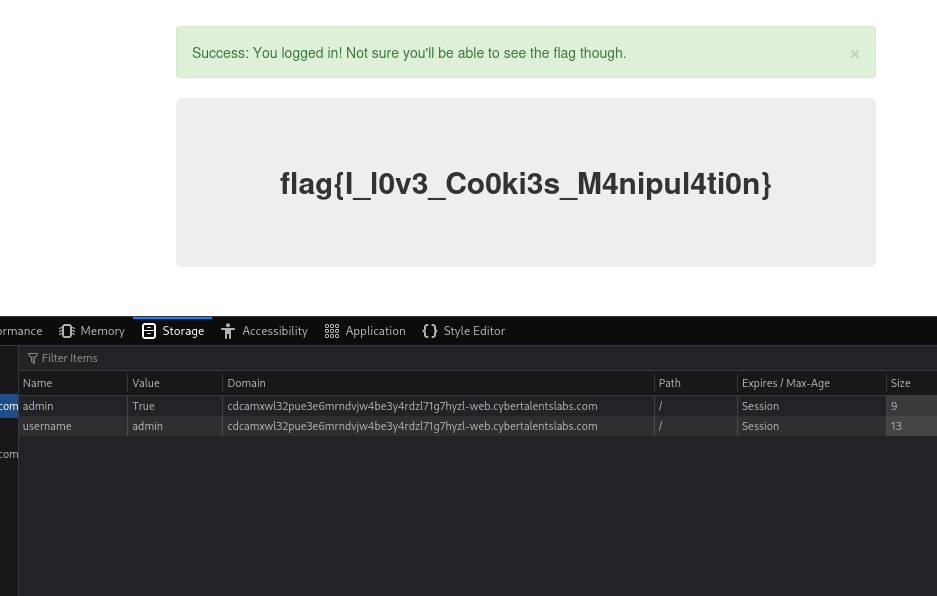

Challenge Name:  Secret Blog

Since I didn’t find any comments any robots.txt and checked the requests didn’t have any something special I tried for user admin’ or 1=1--  and no password and it actually got me to a new endpoint

I opened the developer tools and found this

so I changed the value of admin to True and the username to admin and I got the flag

flag{I_l0v3_Co0ki3s_M4nipul4ti0n}
