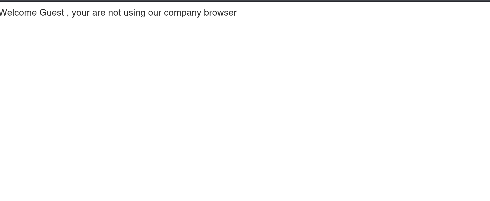
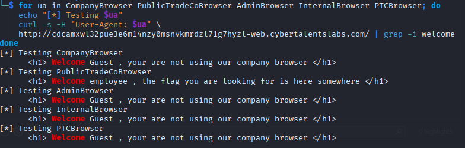
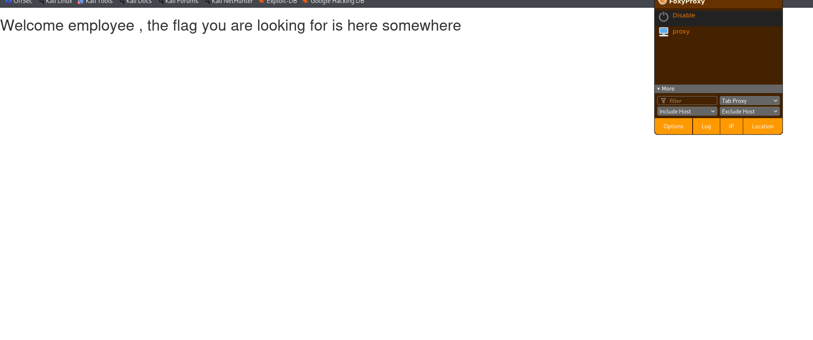
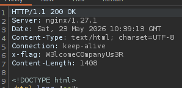

Challenge Name:  Secret Browser

After inspecting everywhere I didn’t find any robots.txt any hidden comments so I intercepted the request I figured that I could Inject the “user-agent” parameter in the request so I made chatgpt make me an automated script to test many known user-agent headers

I found it the header is PublicTradeCoBrowser 

After looking everywhere I opened burp to check the response and I found in the response header the flag

W3lcomeC0mpanyUs3R

