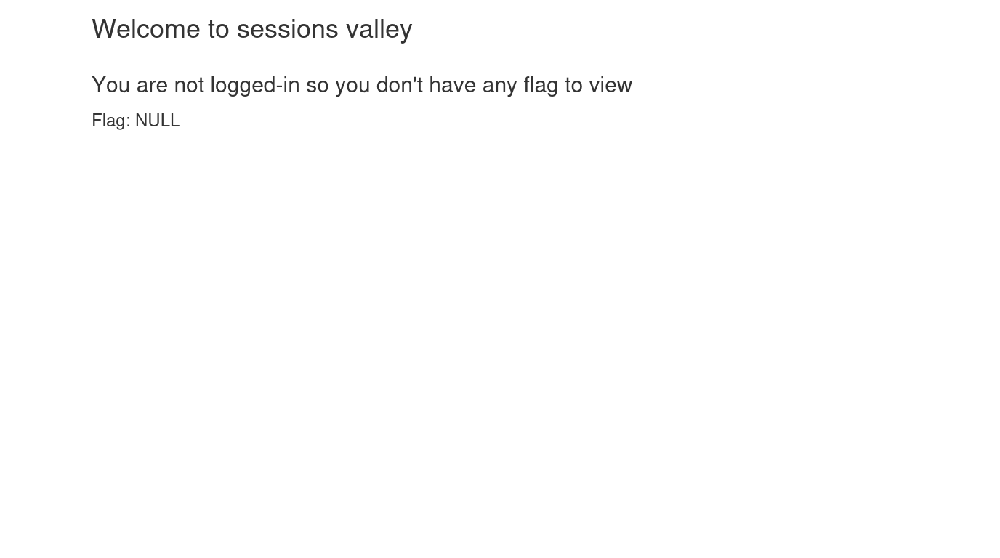
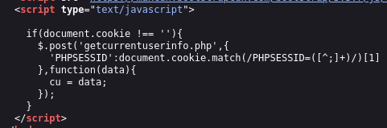
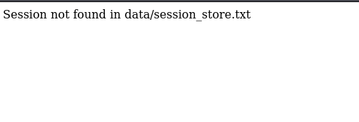
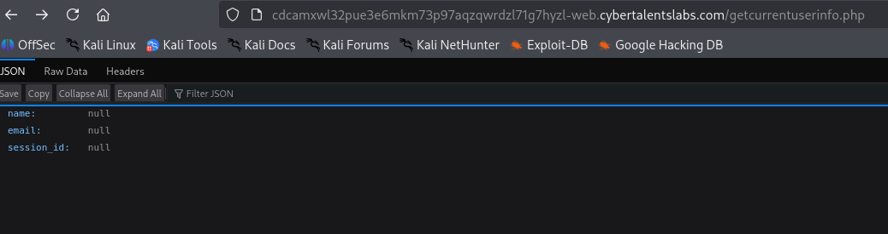
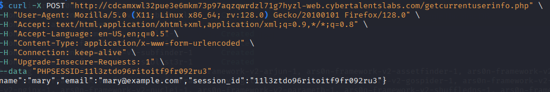

Challenge Name:   The Restricted Sessions

I tried inspecting the page source for any more info and I found this

So I tried in burp repeater to add a PHPSESSID parameter and modify it

I found this endpoint containing those sessions

iuqwhe23eh23kej2hd2u3h2k23
11l3ztdo96ritoitf9fr092ru3
ksjdlaskjd23ljd2lkjdkasdlk
after navigating to /getcurrentuserinfo.php

After altering the request I logged in and got the flag

Flag: sessionareawesomebutifitsecure