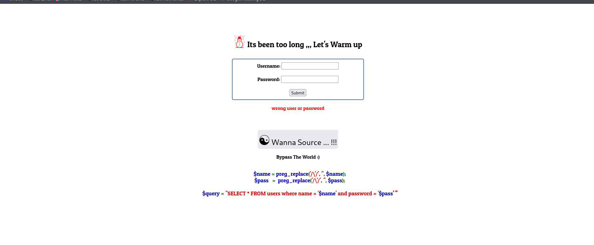
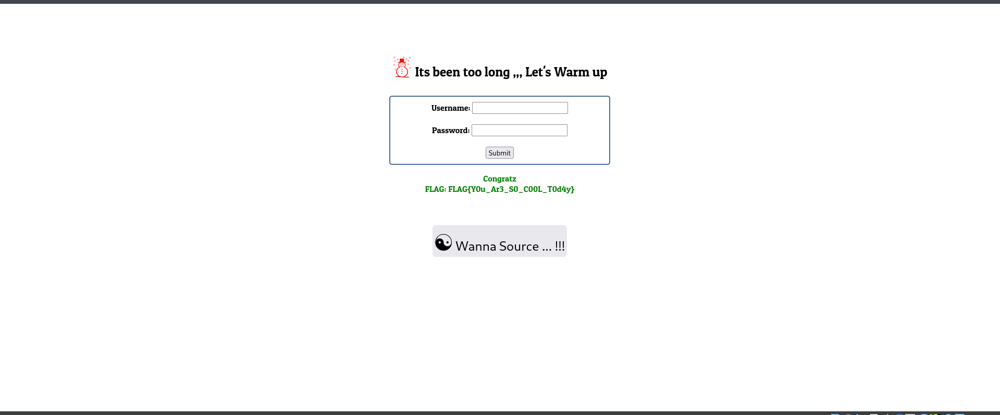

Challenge Name:  bypass the world

First I found a login page with a button “Wanna Source …!!!”
so I clicked it and it gave me a code which how the site handle the login
the code is a classic input filtering to prevent sqli attacks but its still vulnerable 
By injecting (\) in the username parameter it was possible to break the quote added by the application this allowed me to add OR 1=1# in the password parameter this allowed me to perform sqli authentication bypass and solve the challenge

FLAG{Y0u_Ar3_S0_C00L_T0d4y}

