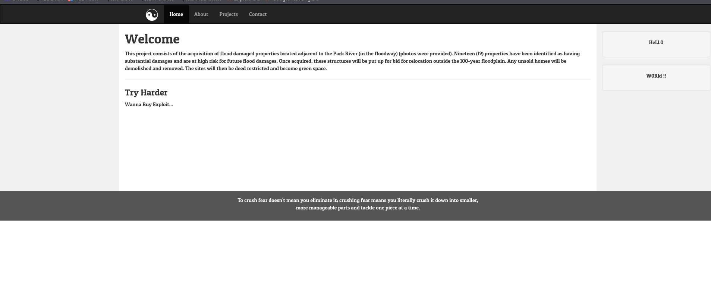
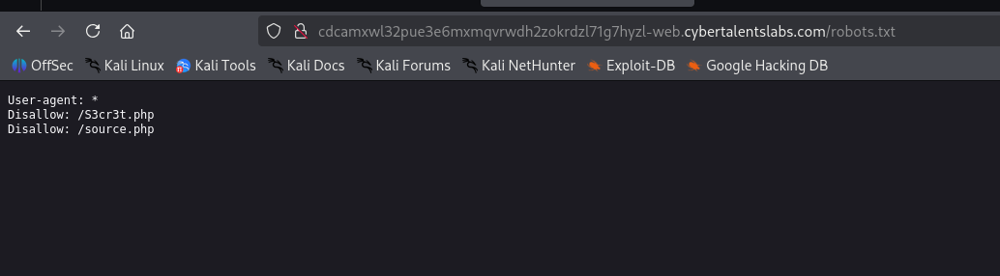
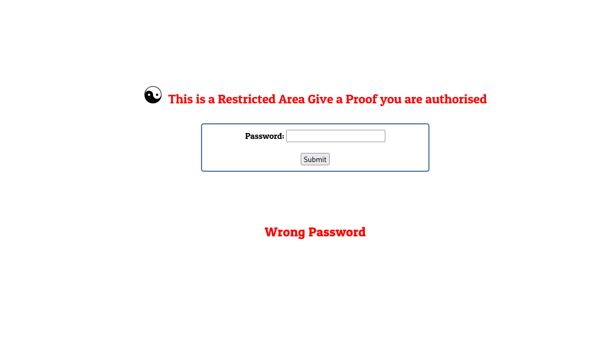
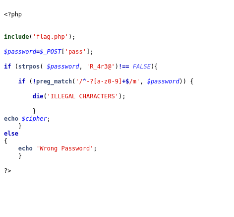
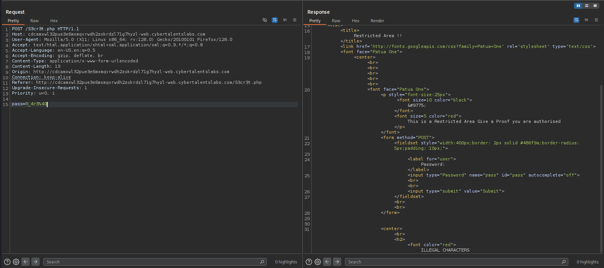
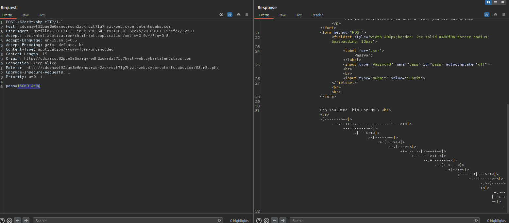
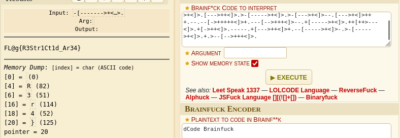

Challenge Name:   catch me if you can

I found nothing also after inspecting the page source so I tried if there is a robotst.txt and there was

I found in the S3cr3t.php login page demanding a password

In the source.php I found the code that the login works 

I captured the request of trying to logging in and sent it to repeater

I tried many payloads and searched and the conclusion that I had to url encode the payload and this is the final payload f%0aR_4r3@

the response contained a brainfuck encoding so I used this site https://www.dcode.fr/brainfuck-language to decode the response

FL@g{R3Str1Ct1d_Ar34}